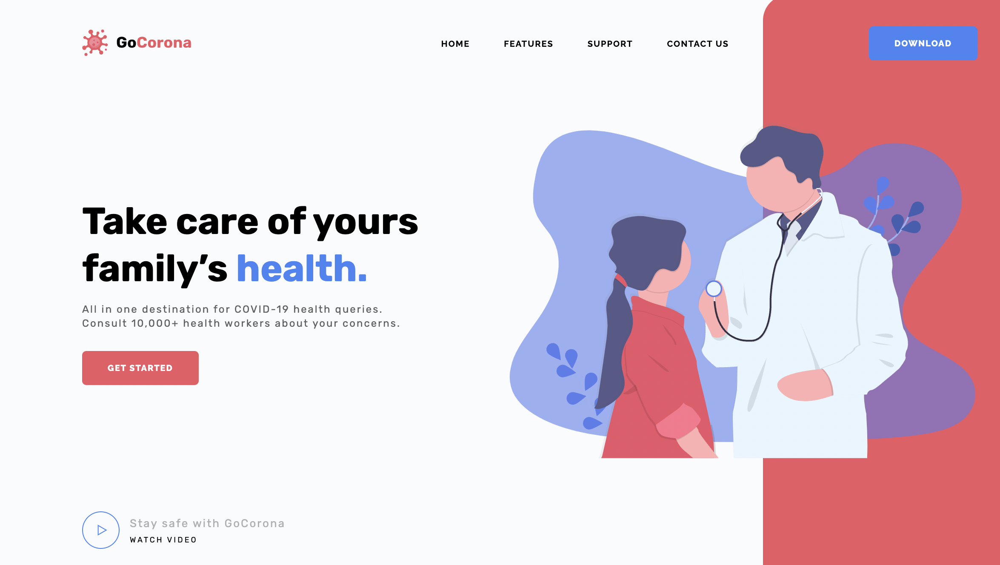

## Anastasia Komar

#### Junior Frontend Developer
---
#### Contact information:

**Phone:** +375 (29) 205-52-29
**E-mail:** yukarimoore@icloud.com
**Telegram:** @yaruta

---
#### About Myself:
My path began with admission to a technical college, where "Programming of local computer networks" was taught in the last courses. I graduated at the end of February and began to study the frontend in more depth, they offered a project on html + css, after I found out about this course and now I am writing about myself. 

The main field of activity at the moment is coffee and coffee drinks. About a year ago, in addition to studying, I worked as an administrator of quest rooms.

I believe that the motivation and interest in learning this field of activity will help me become an experienced Frontend developer.

---
#### Skills:
- HTML5, CSS3
- GitHub
- VS Code
- Autocad
- Altium Designer
---
#### Code example:
Automatic location. The task was carried out when developing a weather forecast.
```
async function getWeather(place) {
	const url = `https://api.openweathermap.org/data/2.5/forecast?q=${place}&units=metric&appid=66b3c3e1676ddd60a73d8a3160445061`;
	const res = await fetch(url);
	const data = await res.json();
	render(data)
}
```
---
#### Work experience

##### [*GoCorona*]( "https://nastyakomar.github.io/gocorona/" ) 



---
#### Education
+ *BSUIR affiliate "Minsk Radioengineering College"*
+ *RS Schools Course «JavaScript/Front-end. Stage 0» (in in the process)*
---
#### Languages:
+ Russian - Native
+ Englesh - Elementary 

